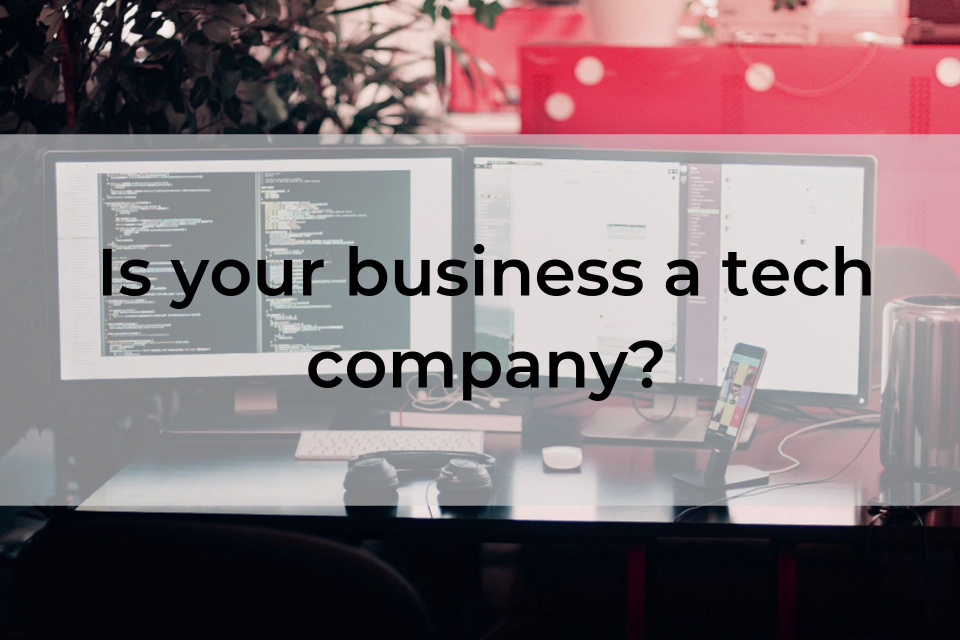

Whether we're hailing a ride, ordering dinner to our door or shopping online, we buy from businesses that call themselves tech companies almost every day.

But what really makes a tech company, and how do you know if you are one? Today, we'll explore what it means to be a tech company in 2019 and beyond.

<!-- end excerpt -->

## What is a tech company, anyway?

When most of us think of "tech companies", we still picture multi-billion dollar social networks, computer manufacturers and SaaS companies like Facebook, Instagram, Apple, Google, Spotify, Dropbox and more. But the definition of a tech company is much broader and fuzzier than many realize. 

While it definitely [includes businesses that focus on developing and manufacturing technology as a service](https://en.wikipedia.org/wiki/Technology_company), in recent years it's expanded to encompass [definitions like these](https://www.inc.com/magazine/201605/marli-guzzetta/tech-company-definition.html), as covered by Inc. Magazine:

"You are a technology company if you are in the business of selling technology - if you make money by selling applied scientific knowledge that solves a concrete problem."  - Alex Payne, Co-Founder, Simple 

"A tech company uses technology to create an unfair advantage in terms of product uniqueness or scale or improved margins. Ask the question: Could this company exist without technology? If the answer is no, it has to be a tech company." - Greg Bettinelli, Partner, Upfront Ventures

"I think there's a false dichotomy in the idea that a company either is or is not a tech company. I think it's possible for a company to be a hybrid if tech is giving it an edge over incumbents." - Hayley Barna, Venture Partner, First Round Capital

One of the most clear-cut examples of a non-tech entity [trying to call itself a tech company](https://www.vox.com/recode/2019/8/14/20804029/wework-ipo-tech-company-valuation) is WeWork, which operates a series of coworking spaces around the world. Its owner the We Company recently [shelved its initial public offering](https://www.businessinsider.com/wework-ipo-fiasco-adam-neumann-explained-events-timeline-2019-9#heres-a-30-second-explanation-of-whats-going-on-1) amid concerns from investors and the media about its finances, path to profitability and leadership. Following that, WeWork hit rocky waters as its co-founder and CEO Adam Neumann stepped down, thousands of employees were laid off and WeWork's valuation tumbled from $47 billion to about $10 billion. News website Vice [recapped a comparison](https://www.vice.com/en_ca/article/ne8dbw/ceo-of-wework-which-has-lost-an-unfathomable-amount-of-money-is-stepping-down) between WeWork and Uber: 

> ...Both founders thrived precisely because of a founder cult, a "growth at all costs" mentality that burned through billions, sky-high valuations that were fairy tales, and constant attempts to label themselves as tech companies to pump valuation.

Stratechery, a blog that analyzes the strategy and business side of technology and media and the impact of technology on society, [captures the ambiguity of the distinction between "tech" and "non-tech" status](https://stratechery.com/2019/neither-and-new-lessons-from-uber-and-vision-fund/) perfectly:

> Just because Uber's critics were wrong to assume that the service was analogous to taxis does not mean that those of us on the other side - not only of the Uber question but of a host of other similar companies that straddle the physical and digital worlds - were completely right in our assumptions either.
>
> The opposite of an old-world company is not necessarily a tech company. It is something we haven't quite seen before, and applying either old-world rules or tech rules is a mistake.

That said, statistics show there may be a [shift happening in how businesses are marketing themselves](https://www.vox.com/recode/2019/9/12/20861449/peak-tech-company-wework-peloton-uber-slack) to investors and customers: company documents referencing "tech" and "technology" peaked around August 2018, and have since declined about 12 percent.

## Questions to ask yourself

As software consultants, we've met business owners who either:

- don't see technology as being a core part of their business when it is, or
- think technology plays a larger role in their business than it does in reality

Both are dangerous. To find out whether you've got a blind spot in this area, look around at your office and staff and ask yourself these questions: 

- How are you fulfilling your company's technical needs? 
- How many of the technologies you use today are mission critical to your business (in other words, you couldn't operate your business at full capacity without them)?
- Will your current suppliers, vendors and technologies be around in the next three, five, 10 (or even two) years?
- Are you a consumer or producer of technology (or both)?

*Every company has technical needs and dependencies. How are you meeting yours, and what challenges will you have in the future?*

In the 21st century, every single company has technical needs and dependencies. For example, within a relatively short timespan, automation has drastically changed how both digital and bricks-and-mortar businesses operate. We can now [automate tedious tasks](https://www.customprogrammingsolutions.com/blog/2019-08-21/solve-problems-process-automation/) such as data entry, sorting and responding to emails, appointment scheduling, sending recurring invoices, customer support and more. 

You might start with a few Excel spreadsheets before moving on to Enterprise Resource Planning (ERP) and ordering, and be automating with APIs before you know it. 

The logistics industry is another timely example - just a few years ago, no one would have thought of a trucking business as tech-oriented, but even "traditional" companies like these have shifted to become more tech-heavy with the arrival of autonomous driving vehicles. 

We can also look to the airline industry; without using technology for everything from security to flight control and navigation, every airport in the world would be at a standstill. 

If you lost your most technical staff or could no longer access the tools they use, what would happen? If your first thought is you'd have to close up shop, you are likely a tech company. If nothing would change, you're clearly not one.

### Are you a consumer or producer of technology?

There's also a distinction between whether we're using these technologies as a consumer or as a producer. 

In automation, those lines are often substantially blurred. For illustrations of this, look no further than Excel for data analysis or WordPress for content management. Historically, most technologies had at least three levels of users:

- **Beginner or casual user** 

  This is the bucket most of us fall into; casual users who use the tool or software on a regular basis. We understand enough to do what we need to (or who/where to ask for help), but wouldn't qualify as experts). 

- **Admin or expert user** 

  These are highly skilled users with advanced expertise. They're sometimes assigned additional administrative rights and responsibilities depending on their role and requirements.

- **Producer or Creator** 

  These people created, developed and released these systems and technologies. 
  
## Roles can evolve over time

Sometimes, these roles can evolve depending on your situation and requirements. For example, most WordPress users use plugins on top of their plain WordPress install to extend the functionality of their websites. They may have a third party create a new plugin to meet their needs. While they're still a consumer in terms of capacities, their position quickly becomes blurry if their business strongly depends on the features and functions of that plugin. In other capacities, your business might use a technology, but not rely on it. 

In some cases, the transition between consumer and producer is driven by business concerns and in others, it's driven by talent issues. With some consulting gigs, it can be exceedingly profitable (and possible) for consumers to become producers (consider people who use a cloud service for convenience as consumers, but then take that service back in-house to save on costs). 

In SaaS (Software as a Service), producer/consumer roles can sometimes become less definitive, as people who were once producers become consumers of a product (think subscription-based software that lets you edit photos, create proposals, manage documents or content, do your accounting and more).

## Consider the risks of outsourcing vs. in-house production

When debating whether to rely on technology built by third parties or produce it in-house, consider the continuity risk to your business. Look to Microsoft Excel for an example - as [Joel on Software](https://www.joelonsoftware.com/2001/10/14/in-defense-of-not-invented-here-syndrome/) notes, their development team's motto was, 'Find the dependencies - and eliminate them.' In fact, Excel even had its own C compiler - a calculated measure designed to give Microsoft the quality control they needed.

In this scenario, using external tools would have been a massive liability; it made sense not to outsource these things, since they were at the core of what made the product unique. 

If the creators of Excel lost the ability to change the core functionality due to a third party's decisions, the entire product would effectively die. Many technology products face a similar situation; they can't outsource their technology since the technology is their core competency. 

In Excel's case, continuity risk isn't the only factor - it would be exceptionally difficult to find another party who could maintain and grow the software. This is partly why deciding whether to outsource is one of the most meaningful decisions a tech company has to make (if outsourcing is even possible considering their circumstances). 

Keep in mind that there's risk in taking either path - outsourcing or producing in-house, and that risk can be transferred and transformed. We often see people mistakenly assess each of these distinct risks with the same metrics - a critical mistake since the nature of the risk is quite different.

Sometimes, non-technical managers - especially those with expertise in commodity products but not tech - mistakenly assume a third party always exists or is available to supply key components, even at high price points. This isn't always the case, and can prove to be a serious error in decision-making that could result in costly delays, cancellation, and lost revenue and opportunities. 

The solution: look for the best possible alternative. Of course, this may vary depending on your specific circumstances. 

## The takeaway: Every company is technical to some degree 

The question of whether your business should brand itself as a tech company isn't just a matter of semantics - it will have serious implications for your brand, your future and your marketability. 

One of the costliest mistakes we make in business is making false relative comparisons, and here the danger is clear; negatively compare yourself to the Googles and Amazons of the world and you will assume you shouldn't claim tech company status. 

While most of us aren't on the scale of the world's largest tech giants, we do have technical elements, roles and challenges within our businesses. Don't forget to assess them regularly, and make backup plans to fulfill those needs if required.

