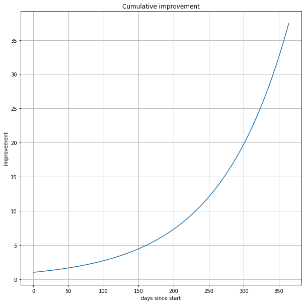
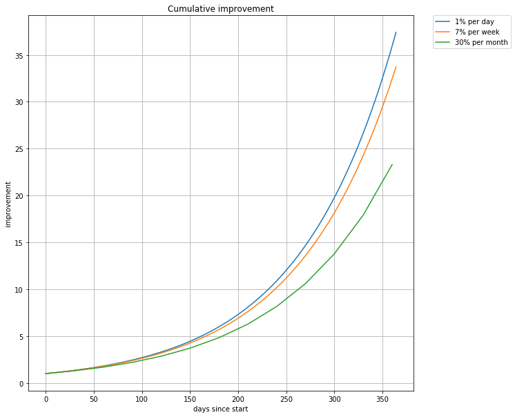
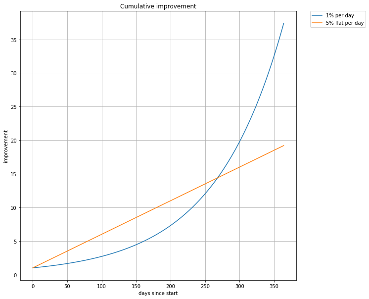

Making a 1 percent improvement each and every day will make an enormous impact at the end of a year.

The way in which this works is not intuitive to many people due to the nature of exponential growth. This sort of compounding interest is what makes for a great case in running the numbers and making some visualizations.

If you are making a 1% improvement each day after ten days you end up with $$1.01^{10} = 1.104622125$$ which is a 10.5% gain. How about after 20 days?

$$1.01^{20} = 1.22019004 $$ which in percentages is 22% gain

What about a year?

Have a think about how much improvement you get after a year of a 1% gain each and every day. What figure did you get? How did you make this estimate?

$$1.01^{365} = 37.78343433288728$$ so once a year is up you get 3778% gain from a one percent improvement each and every day!

## The mathematics of continuous delivery

Putting aside all the benefits of revealing information faster by having shorter feedback loops it's interesting to see how just the compounding interest effects work out.

What's the difference in the overall gain between 1% per day each day vs 7% per week each week vs a monthly schedule like 30% every 30 days?

A plot really helps show what's going on:

The quicker improvements can be integrated the more you benefit from the compounding growth aspect.
There's more than just a correlation between organizations that can deliver faster iterations and increased effectiveness. The book Accelerate by Nicole Forsgren, Jez Humble and Gene Kim has a good discussion of this in the context of the tech industry.

## Building intuition into exponential growth curves

One great suggestion I got from [Aapeli](/team/aapeli/) is to point out how in an exponential growth situation that the time taken to double whatever quantity is in play is constant if you have exponential growth.

For example say we have our 1% per day improvement we can see solve for the amount of time taken to get a doubling in terms productivity by solving this equation:

$$
2 = 1.01^t  \\
\log 2 = \log{1.01^t} \\
\log 2 = t \log{1.01} \\
t = \frac{\log{2}}{\log{1.01}} \\
t = 69.66071689357483
$$

So we can see that after 70 days the amount of productivity doubles if we are increasing the amount of productivity each day by one percent. But *every* 70 days we always get a doubling. Let's plug in some numbers to see how this works:

t (days)| productivity
--------|-------------
0       |  1.0
70      |  2.006763368395385
140     |  4.027099216733592
210     |  8.081435189034718
280     |  16.217528101416306
350     |  32.544741319844995 

The numbers make this clear, every time you go 70 days you double the productivity.

It doesn't matter how small the exponent is (as we see with our 1.01 here), with exponential growth you always have this doubling effect.

## Would you rather get 1% a day compounding or 5% per day non compounding?

This question is an interesting one, would you prefer a one percent increase that compounds each day or a five percent increase that does not compound each day?

What is your guess at which is best?

I think a plot is very useful to see what's going on:

As you can see there's a point in time where the compounding growth catches up with the flat growth rate. *After* this point the compounding growth leaves the linear growth completely behind, more about judging where this point occurs and what implications that has in a later post.

## How this applies to real software/hardware/etc projects

It would take a while to do this topic justice and as seen earlier releasing more value incrementally is the way to go to maximize impact. So more on this in another article soon.
