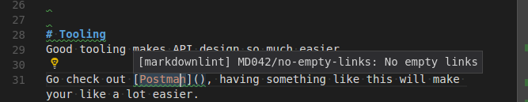

Even before we moved our site to a [JAM stack](https://jamstack.org/) we found that we edited a number of [Markdown](https://en.wikipedia.org/wiki/Markdown) files every day, for example those README.md files on our GitHub repositories and various other bits of documentation.

Because markdown is not [WYSIWYG](https://en.wikipedia.org/wiki/WYSIWYG) unless you have an editor with a built in preview a noticeable hassle when you edit markdown files is that sometimes you have errors that you only notice when you build the pages.
Having a long feedback loop definitely impacts your productivity, most notably because it risks interrupting the flow of your writing if you have to build the pages to validate that they work.
Getting any extra efficiency for performing frequent tasks such as this is a noticeable win.

## Use an editor that can properly support markdown

Because Markdown is a markup language an editor that will do proper [syntax highlighting](https://en.wikipedia.org/wiki/Syntax_highlighting) is very useful when editing Markdown files. As such we often edit markdown with [Vim](https://www.vim.org/) or [VS code](https://code.visualstudio.com/).

Just like editing other code you could use any text editor but one that is designed for editing code will provide a substantially better user experience for editing. Proper syntax highlighting in particular lets you more readily see the structure of what you are doing and makes it easier to spot mistakes.

One really good feature of editors that support Markdown well is that they highlight the code blocks with the same syntax highlighting for that language. This makes writing articles containing code snippets much easier. Notice in this screen-shot how JavaScript and Python are both highlighted properly.

## Linting via VS Code plugin

Seeing as we use VS Code already we can install a [markdown linter extension](https://github.com/DavidAnson/vscode-markdownlint) that gives immediate linting for our Markdown files.

So for example have a look at this screen-shot from when I was writing a draft for a post on here:

Because of the integration with the IDE I'm getting immediate feedback in my editor that something is wrong via those green squiggly underlines, I don't have to generate the pages to catch these errors and every time I can catch a mistake faster is a productivity gain.

## Spell checking

It's great to have a spell checker in the editor if you are editing a lot of Markdown content. This allows you to get immediate feedback about spelling mistakes which will let you be more productive and write higher quality content.

VS Code has a [spell checking plugin](https://github.com/Jason-Rev/vscode-spell-checker) that we install for our Markdown editing environment.