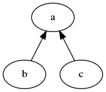
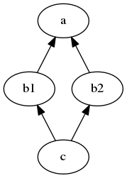
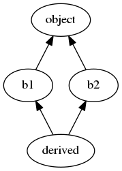

Wondered how Python chooses what method to call in class hierarchies?

Sample code can be found here: https://github.com/CustomProgrammingSolutions/PythonMRO.git

## Figuring out what method will be called

In an arbitrary class hierarchy we have a graph of dependencies that overall specifies the behaviour of the classes.

When we call a method on a class we have to find some way in which we will look up which method to call.
This order of classes in which a method is searched is the Method Resolution Order (MRO).

## Python's MRO

[Since version 2.3](https://www.python.org/download/releases/2.3/mro/) Python has used the [C3 linearization algorithm](https://en.wikipedia.org/wiki/C3_linearization) to determine the order in which classes are searched.

In a single inheritance case you just look recursively at each base class until that Base class has no parents.
Given that every class in Python inherits from `object` that will always be the ending point for the search.

Multiple inheritance is a bit more complex, the [documentation on inheritance](https://docs.python.org/3/tutorial/classes.html#inheritance) has an example of how this works with a rule of thumb that should help in understanding the process:

```python
class DerivedClassName(Base1, Base2, Base3):
    <statement-1>
    .
    .
    .
    <statement-N>
```

    For most purposes, in the simplest cases, you can think of the search for attributes inherited from a parent class as depth-first, left-to-right, not searching twice in the same class where there is an overlap in the hierarchy. Thus, if an attribute is not found in DerivedClassName, it is searched for in Base1, then (recursively) in the base classes of Base1, and if it was not found there, it was searched for in Base2, and so on.

When any class is instantiated it calls the function `class.mro` which computes the MRO for this instance and stores this in `__mro__`.
We can access this `__mro__` attribute to see the ordering with which any attribute search will use.

Note that the `__mro__` attribute is read only:

```python
>>> class A:
...     pass
...
>>> A.__mro__ = []
Traceback (most recent call last):
  File "<stdin>", line 1, in <module>
AttributeError: readonly attribute
```

You can change the `mro` function via a metaclass if you want.

## A simple example

Single inheritance is the simplest case we will encounter, consider the following class hierarchy:



```python
"""Example of a simple class hierarchy"""

class A:
    def foo(self):
        print("A")

class B(A):
    def foo(self):
        print("B")

class C(A):
    pass

a = A()
a.foo()
b = B()
b.foo()
c = C()
c.foo()
```

When run this gives the following:

```
A
B
A
```

This is mostly what you'd expect, the derived classes are looked up first and any method that is not implemented is then searched for in the base class.

```python
>>> B.__mro__
[<class '__main__.B'>, <class '__main__.A'>, <class 'object'>]
>>> C.__mro__
[<class '__main__.C'>, <class '__main__.A'>, <class 'object'>]
```

The lookups are as indicated by what's found in `__mro__`.

## A more complex example

In a simple linear structure the lookup goes from the derived class all the way to the base class. If the method is not found at the time the base class is searched you will get an `AttributeError` when the method can't be found.

What about the classic non-linear structure that causes problems, [the diamond class hierarchy](https://en.wikipedia.org/wiki/Multiple_inheritance#The_diamond_problem).



There's more than one path to get to the base class, we have to resolve this somehow.

```python
"""Example of a diamond multiple-inheritance class hierarchy"""

class A:
    def foo(self):
        print("A")

class B1(A):
    def foo(self):
        print("B1")

class B2(A):
    def foo(self):
        print("B2")
    def bar(self)
        print("B2")

class C(B1, B2):
    pass

a = A()
a.foo()
b1 = B1()
b1.foo()
b2 = B2()
b2.foo()
c = C()
c.foo()
```

When we run this we get:

```
A
B1
B2
B1
```

We can see that this has resolved the call to `c.foo()` to `B1.foo` over `B2.foo`.

What about `c.bar()`?

```python
>>> c.bar()
"B2"
```

We can see from this that `B2` is checked first before `A` in this case.
Dealing with multiple classes on the same level of the inheritance graph is a deterministic situation governed by Python's method resolution order.
(The rule of thumb states that left-to-right is the order of classes)

```python
>>> C.__mro__
(<class '__main__.C'>, <class '__main__.B1'>, <class '__main__.B2'>, <class '__main__.A'>, <class 'object'>)
```

Note that this does not contain any duplicate entries, which is guaranteed by the algorithm used.

### All multiple inheritance in Python has a diamond topology embedded in it

The diamond pattern for illustrating a multiple inheritance trouble zone is a bit of a cliche in other languages because you can often structure your classes to not do this with a bit of work.

However all classes in Python inherit from `object` which means that any time you have inherited from multiple classes you effectively have a diamond pattern with `object` at the base.

For example:

```python
class B1:
    pass

class B2:
    pass

class Derived(B1, B2):
    pass
```

Will have a topology like this:




## The role of super

TODO: super

There's a function called [`super`](https://docs.python.org/3/library/functions.html#super) that gives you the ability to call the next class up in the MRO without having to specify it by name.

Super calls the *next* method along in the MRO chain.
Note that this is *NOT* necessarily the same as the superclass.

The [Dylan language](https://en.wikipedia.org/wiki/Dylan_(programming_language)), which influenced Python's MRO development, refers to this as [the `next-method` function](https://opendylan.org/books/drm/Method_Dispatch#XREF-858) which more clearly explains what it does.