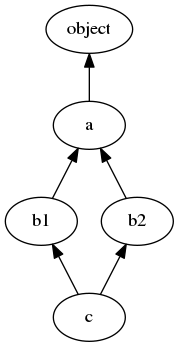

Wondered how Python chooses what method to call in class hierarchies?

Sample code can be found here: https://github.com/CustomProgrammingSolutions/PythonMRO.git

## Figuring out what method will be called

In an arbitrary class hierarchy we have a graph of dependencies that overall specifies the behaviour of the classes.

When we call a method on a class we have to find some way in which we will look up which method to call.
This order of classes in which a method is searched is the Method Resolution Order (MRO).

## MRO

When a class is instantiated it calls the function `class.mro` which computes the MRO for this instance and stores this in `__mro__`.
We can use this to see the ordering.

[Since version 2.3](https://www.python.org/download/releases/2.3/mro/) Python has used the [C3 linearization algorithm](https://en.wikipedia.org/wiki/C3_linearization) to determine the order in which classes are searched.

You can change the `mro` function via a metaclass if you want.

## A simple example

Single inheritance is the simplest case we will encounter, consider the following class heirarchy:


```python
"""Example of a simple class hierarchy"""

class A:
    def foo(self):
        print("A")

class B(A):
    def foo(self):
        print("B")

class C(A):
    pass

a = A()
a.foo()
b = B()
b.foo()
c = C()
c.foo()
```

When run this gives the following:

```
A
B
A
```

This is mostly what you'd expect, the derived classes are looked up first and any method not implemented is then searched for in the base class.

```python
>>> C.__mro__
[<class '__main__.C'>, <class '__main__.A'>, <class 'object'>]
>>> B.__mro__
[<class '__main__.B'>, <class '__main__.A'>, <class 'object'>]
```

The lookups are as indicated by what's found in `__mro__`.

## A more complex example

In a simple linear structure the lookup goes from the derived class all the way to the base class. If the method is not found at the time the base class is searched you will get an `AttributeError` when the method can't be found.

What about the classic non-linear structure that causes problems, [the diamond class hierarchy](https://en.wikipedia.org/wiki/Multiple_inheritance#The_diamond_problem).



There's more than one path to get to the base class, we have to resolve this somehow.

```python
"""Example of a diamond multiple-inheritance class hierarchy"""

class A:
    def foo(self):
        print("A")

class B1(A):
    def foo(self):
        print("B1")

class B2(A):
    def foo(self):
        print("B2")
    def bar(self)
        print("B2")

class C(B1, B2):
    pass

a = A()
a.foo()
b1 = B1()
b1.foo()
b2 = B2()
b2.foo()
c = C()
c.foo()
```

When we run this we get:

```
A
B1
B2
B1
```

We can see that this has resolved the call to `c.foo()` to `B1.foo` over `B2.foo`.

What about `c.bar()`?

```python
>>> c.bar()
"B2"
```

We can see from this that `B2` is checked first before `A` in this case. This thankfully is a deterministic situation that is governed by Python's method resolution order.

```python
>>> C.__mro__
(<class '__main__.C'>, <class '__main__.B1'>, <class '__main__.B2'>, <class '__main__.A'>, <class 'object'>)
```