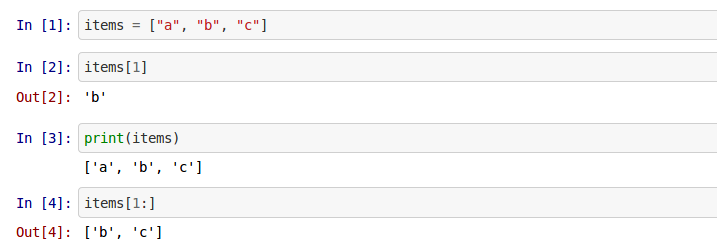
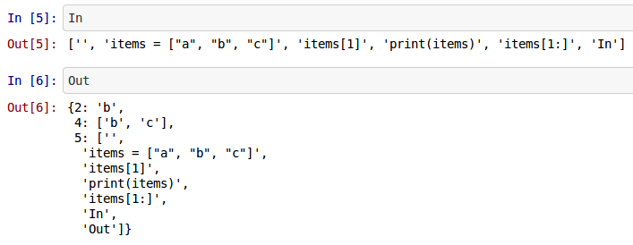
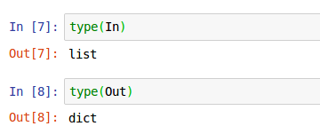

Wondered what those `In[10]` and `Out[10]` things are in your jupyter notebooks and how to make use of them?

<!-- end excerpt -->

See the [notebook source on Github](https://github.com/CustomProgrammingSolutions/jupyter_examples/blob/master/CellInputsAndOutputs.ipynb)

[jupyter notebooks](https://jupyter.org/) are a powerful browser based interactive computing notebook that makes it super easy to make high quality presentations of data. Jupyter has got popular in recent years because it lends itself very well to data science tasks as it makes it easy to work with data and create nice visualizations and reports from within the browse.

These notebooks are built on top of [IPython](https://ipython.org/) which provides the kernel that jupyter notebooks run on top of. So in the background the code is sent to the kernel where it is then run (unlike javascript the code doesn't run in the browser).

The nature of the interactivity is such that the input and outputs are not based on the traditional file based structure but on cells that get executed in a certain order.

Here's a fairly simple example of a jupyter notebook:

Breaking this down a but we see on the first line marked with `In[1]` that we have defined some items in a list.

On the second line we output a single item and because it's the last item executed it gets placed into the output for that cell which is `Out[2]` (note that this is just the default behavior, you can change this if you want).

You can interact directly with the `In` and `Out` from within cells themselves like so:

The `In` and `Out` are just a simple `list` and a `dict`:

