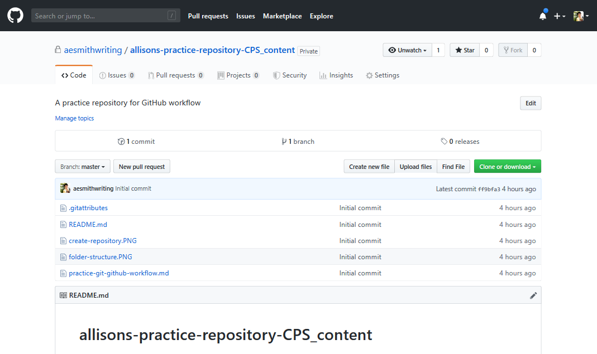
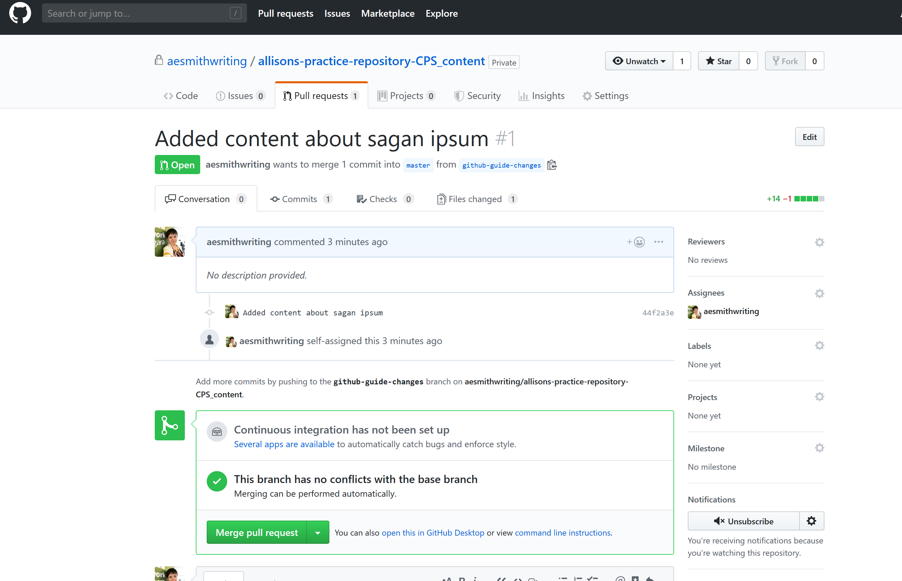

## Introduction

Last year, my simmering rage at conventional word processors finally boiled to the surface, driving me to take the drastic action I'd been putting off for years: Learn to write and publish content using Git and GitHub (*insert gasp here*.)

Okay, maybe that's being a *bit* dramatic (hey, I'm a writer - I'm using creative license here). It wasn't exactly rage. More like an underlying frustration I couldn't quite put my finger on. After all, what was different about this project versus the hundreds I've worked on before, that made working with Word (or Google Docs, my old go-to) untenable?

Actually, a few things:

- I was working remotely on a long-term project for a startup software development client with high technical expertise located on the other side of the world.
- We needed a central, open-source, reliable platform that everyone knew how to access and use.
- We had several collaborators, each with valuable insights and perspectives to offer on the content I created.
- With so many small pieces of content, we needed an easy way to track progress, revisions and dialogue on each one.

Enter GitHub. After a couple of months plugging away on Google Docs (a tool I'd sworn by previously and still use for collaborating with less technically savvy clients on short-term projects), we all began to discover its limitations when it came to formalizing an efficient content production and approval process. My client (Scry Engineering) generously offered to teach me how to use Git and GitHub so we could collaborate more productively long-term. *Bonus: I get to share what I learned with you!*

I'll cover the following:

[TOC]

## What are Git and GitHub?

### Git

[Git](https://git-scm.com/) is a powerful tool for tracking and making changes to documents. It makes it easy for several people to collaborate on the same document simultaneously, then merge those changes together automatically. They can then comment and reference individual changes.

Git does this by comparing documents and creating a list of changes, or differences between files. These are known as *[deltas](https://study.com/academy/lesson/what-is-delta-definition-lesson-quiz.html)*, derived from the fourth letter of the Greek alphabet (comparable to our 'D'). Its most common meaning is the difference, or change, in a certain quantity.

Essentially, Git is open source software built and used by software engineers, developers and the like. For us writers, content creators and publishers, some exciting options appear at our fingertips, including:

- reports on differences between versions

- easily merging changes to documents (which can be confusing with Word or other word processors)

- referencing change sets directly (so you and your collaborators each understand exactly which changes are being discussed)

You'll want to download a text editor and use Markdown (a lightweight, plain text formatting syntax that makes documents easy to write) to create your content. (We'll expand on Markdown and its benefits later in this post. Essentially, formatting your content in text-based documents will work well with GitHub, and Markdown is one such format that plays nice with Git.)

### GitHub

[GitHub](https://github.com/) is an online service that allows users to use Git online, while providing powerful tools for collaboration. With these tools, you can:

- collaborate with other authors on code, web pages, etc.,
- review one another's edits
- create or start a dialogue using Issues
- make your repositories public or private, accessible only by contributors you choose (you can use private repositories with up to 3 contributors for free, but will need the paid version for teams of 4+)
- allow your repositories to be cloned or downloaded, so other people can work on the files they contain

## Who needs this guide?

This is a guide for writers, by a content marketer who's been where you are: frustrated with the constraints and headaches current writing software and workflows foist on us, and wondering if there's anything better - an open source, distraction-free, secure platform that supports hassle-free collaboration between you and your clients.

That said, you don't have to have "writer" anywhere in your title to use this guide. If you produce text content that gets published online, this primer is for you.

## Why should writers use GitHub?

Git is a repository hosting service much-loved by developers for its robust version control, issues management and change tracking capabilities. It turns out, writers are on a continual quest for a tool that offers these features and allows them to work on a truly collaborative basis with their clients.

### The problem(s) with word processors and web-based writing tools 

Have you ever worked on a document with multiple authors? Some of you may be Mac people, while others are Windows or Linux diehards. Regardless, you all need to be able to see and give feedback on each other's work. This is where conventional Word processors and web-based programs can get a little clunky. Here are some common pitfalls:

#### Duplicate or redundant content

With word processors, you often end up with a Definitely-Final-Revised-Version-12, or even worse, there are multiple documents floating around with changes that will have to be vetted and amalgamated into one.

#### Unfriendly file formats make for wasted time

Sometimes things can go wonky if documents are saved and opened in different file formats or programs, or saved on different versions of the same program (not all is equal in the land of Mac, Windows and other operating systems). Even today, devices don't always play nicely with one another. Consequently, you can't be 100% sure your document will open and display correctly for everyone.

#### True collaboration is a hassle

Dialogue makes collaboration work, and the ability to easily provide feedback on documents (especially if you work remotely) is essential. The commenting systems in both conventional and web-based programs leave much to be desired, as your page gets so messy, the content becomes obscured. You find yourself actually dreading giving or receiving feedback, as each comment adds to a tangled web of suggestions, crossed-out paragraphs, and different-coloured replies in the margin. The content takes a back seat to noise.

#### Losing data could mean a frustrating setback

We've all done it: spent days working away painstakingly on a document, saving it, shutting down and forgetting to back up. Then disaster strikes: our laptop goes missing, a flood happens, or a hard drive quits. All of our work is up in smoke and we've got some explaining to do. Always frustrating, and sometimes devastating to a project on a tight timeline. Unless you save your file in the right place and take the time to back up, you're taking a huge unnecessary risk with your team's hard work.

### Benefits of distributed vs. centralized systems

In contrast, distributed systems *just work*. Your content will be ready for the web faster, you'll be more productive, and hopefully you'll notice a lot less hassle happening in the process.

Git is what we call a *decentralized version control system*. Here's why that's important:

#### One master document means everyone is (literally) on the same page

One of the most annoying parts of creating, publishing and maintaining content is often tracking changes. Content is a living, breathing entity - it's not a "set it and forget it" thing. Over the lifespan of just one piece of content, there may be hundreds of changes by different contributors. You can see why changes get messy!

Fortunately, Git has us covered. Its sole purpose is to:

- track which changes derive from which
- which are the latest changes
- how the changes have evolved, and
- what the corresponding hierarchy looks like

For us, this means more wasting time trying to figure out which is the authoritative or most up to date version. When anyone clones a repository to their local machine (computer), opens their document, then makes and commits changes, Git checks those changes against previous versions and tracks them.

#### You'll have a stable platform to collaborate with clients and partners

Because the system is decentralized, it's designed to handle multiple people working on the same document at the same time. While some centralized systems (such as Joomla) will lock you out of a page as a protective measure while someone else is editing it, you won't run into this challenge with Git and GitHub.

#### Each repository is essentially a backup

Even if one machine goes down, you can still access your data on GitHub from other machines. The decentralized system is a nice backup feature in disguise. If you didn't have this, you'd need to consider backups and disaster recovery strategies. Not having to be so worried about this means you reduce the mental burden on you and your team, and reduce the risk of a devastating loss of data and hours.

#### Undo and redo changes with version control

Though GitHub can be hard to pick up for the casual user, rolling changes forward or backward is easy thanks to version control - a big plus when you have an entire team creating and reviewing a piece of content.

Although your trusty word processor offers Undo and Redo buttons, once you undo your most recent changes, save and then close your document, that text is gone forever. In contrast, GitHub not only provides an overview of your changes over time, it tells you who made them.

Bonus: Version control boosts the accountability factor among team members, since you'll now be able to track each person's contribution and easily discover who did what, when, and (if the contributor writes a message in their commit) why.

> The fact that these version changes are kept in a distributed manner is an amazing, and literally game-changing, engineering achievement. - Janis Lesinskis

#### A clean, reader-friendly comments section

When two or more people collaborate on content, they usually have discussions about various aspects of that content, including writing or design. Most word processors and editing programs handle these horribly, to the point where you end up with a mess of many mind-numbing paragraphs in the margins of your document. As contributors add their comments, conversations flows quickly become difficult to keep track of.

In GitHub, you'll quickly discover comments appear in a neat box directly under the paragraph being discussed. You can clearly see which contributor made the comments, the dates conversations occurred, easily track the flow of conversations and resolve them once decisions have been made.

## The case for Markdown

In this guide, we're advocating pairing Markdown with Git and GitHub. Here's why:

### One formatting language to rule them all

[Markdown](https://www.markdownguide.org/) is a lightweight markup language you'll swear by once you start using it. Because it's formatted using plain text, your content will transfer easily wherever you need to put it. It will also open and display as intended in any modern word processor.

### Content is easily re-purposed

You don't just create content once for a singular format and forget about it. More than ever, a modern marketing strategy demands content that's re-purposed and reused. As [Daring Fireball](https://daringfireball.net/projects/markdown/syntax) mentions, with Markdown readability is emphasized above all else, and its syntax is intended for the singular purpose of being used as a format for writing for the web. The potential is endless, meaning you've unlocked your content from unwieldy programs and proprietary software. It's free!

Quick note: Git is formatting unaware, meaning it will track the content of your document, but the formatting of your content is up to the document format itself (if you use Markdown, the syntax used dictates the formatting). The format of the document is independent of Git.

## What you need to get started

You'll need to install and set up a few tools that will help you do your work faster and more efficiently. Set up your workflow now and save hours on repeatable tasks.

### Install a Markdown editor

You'll want to work in Markdown for this exercise ([read the passage titled Philosophy in Daring Fireball's Markdown: Syntax](https://daringfireball.net/projects/markdown/syntax) to find out why). Markdown is a simple markup language that's ideal for writers that lets us control the display of the document. We can create lists, add images, format words in bold or italic, include quotes or raw HTML or do other things using a few keys and non-alphabetic characters such as `#`, `*`, or `_`.

[Brush up on Markdown with a tutorial](https://www.markdowntutorial.com/), and keep a [cheat sheet](https://github.com/adam-p/markdown-here/wiki/Markdown-Here-Cheatsheet) on hand. I also like [Markdown Guide](https://www.markdownguide.org/) (these can also be found in the list of extra resources at the end of our guide).

### Typora

[Typora](https://typora.io/ ) gives you a distraction-free space to write, complete with a live preview feature that helps you focus on your content. I love how it helps me see an outline of my document at a glance, import and export different file types and keep track of the size of my documents in terms of words, reading minutes and even lines and characters.

Bonus: The auto pair feature, which auto-completes pairs of brackets and quotes similar to a code editor, is a huge time saver.

You can use Typora on Windows, Linux and OS X.

Other great text editors include:

- [iA Writer](https://ia.net/writer)
- [Ulysses](https://ulysses.app/) (Mac-only)
- [Visual Studio Code](https://code.visualstudio.com/)

### Set up Version Control on GitHub

------

No matter what type of project we're working on, as writers we need to do a few things with every piece of work - type text, save it, and make it accessible for anyone we're collaborating with to contribute and edit our work.

Here's how to set up GitHub to work for you:

1. Download Git to your computer. Find the [Windows installer here](https://git-scm.com/download/win). Mac and Linux users: look to [Homebrew](https://brew.sh/) for the most recent version.
2. Visit [github.com](https://github.com/).
3. Create your account.
4. Download the [GitHub desktop client](https://desktop.github.com/).

That's it! With Git, you can track your own and others' revisions far easier and cleaner than you could in Google Docs, Word or other tools. Plus, you can all simultaneously edit the document by "pushing" your changes.

### So, now you have:

- A working knowledge of Markdown.
- A Markdown-focused text editor (Typora highly recommended).
- A way to upload your content to the web without using confusing word processors or proprietary programs.
- A central storage place for your content. Your team will be able to edit, publish and re-use it painlessly across devices and platforms.

## Getting ready to work

Now that you've got your workspace set up (think of it as having put one of those IKEA desks together), it's time to create a place for your files and make them accessible to your team via GitHub (kind of like setting up a filing cabinet with folders inside). Here's how to do that.

### 1. Create a folder and file

1. Just like on Google Drive, you should keep all related work in one folder so anyone who needs it can find it. I'll share my folder structure for one of my practice repositories. I've got one folder for the main document and supporting files, and one for images.
2. Open Typora.
3. Hit **File -> New**.
4. Name your Typora file whatever you want and save it in your work folder (a file name that describes what's in the document is best).

You should have a basic file structure that looks like this (the folder with my practice repository is highlighted in grey, in the red box):


### 2. Build your GitHub repository

Git might seem intimidating when you first dig into it (I was lucky enough to have [Janis Lesinskis](https://www.lesinskis.com/) personally tutor me in all things Git/GitHub). If you don't have a tutor, this process can still be easily broken down into steps:

1. Open GitHub Desktop.

2. Hit **File -> Add Local Repository**.

3. Select your work folder you created in Step 1.

4. You may have to click **create a repository here**.

5. Hit **Create Repository** or **Add Repository** as requested by GitHub.

6. Check the box beside the words "Initialize this repository with a README".

7. GitHub takes care of everything. You might see hidden files like this in your folder. That's fine, leave 'em there:

   

### 3. Push your repository to github.com

Right now, your GitHub repository is stored on your computer (what we nerds call "stored locally"), but that won't do - the whole point is to have your stuff secure and backed up in an open-source "cloud", accessible and editable by your team. Here's how to make that happen:

1. Go to GitHub Desktop and hit the **Publish Repository** button in the row along on the top.

2. Check **Keep this code private** if you'd like to. A note about public and private repositories from [GitHub's Help site](https://help.github.com/en/articles/setting-repository-visibility):

   > Public repositories are accessible to everyone using GitHub.com, while private repositories are accessible to you and the people you share them with.

   With a GitHub Free personal account, you can have up to three collaborators on a private repository.

   [Learn more about making a repository private](https://help.github.com/en/articles/setting-repository-visibility#making-a-repository-private).

3. That's it for settings, unless you're an organization owner.

4. Hit **Publish Repository**.

5. You'll need to log in to GitHub if you're not already.

6. GitHub Desktop will push your files to the cloud and create a repository on the web-based app.

Now comes the fun part! You get to see your repository all ready to go on [github.com](https://github.com/). Log in and click on the **Repositories** menu. You'll see your repository below:


Here's what your repository itself will look like:



### Some extra stuff to do

#### 1. Invite collaborators to your repository


As we've said above, the real power of Git and GitHub lies in its ability to allow groups and remote teams to collaborate easily when it's time to edit and revise your work. Therefore, you'll want to invite collaborators to your repository.

To do that:

1. Request the username of the person you want to invite as a collaborator. If they don't have a username, they should sign up for GitHub ([see instructions on signing up here](https://help.github.com/en/articles/signing-up-for-a-new-github-account)).
2. On the main page of your repository on [github.com](https://github.com/), go to **Settings -> Collaborators**. In the search box on that page, type in the username, full name or email address of the person(s) you want to add (you'll only be able to find a GitHub user by their email address if they've listed it publicly. Otherwise, use their username). 
3. Select the collaborator's username from the dropdown menu.
4. Click **Add collaborator**.
5. The user will receive an invite by email. Once they accept the invitation, they'll have collaborator access to your repository.

Keep in mind that if you're using GitHub Free, you can add unlimited collaborators on public repositories and up to three collaborators on private repositories owned by your personal account. You'll need to upgrade to GitHub Pro to add more than three people as collaborators.

#### 2. Create a branch

When you create your repository, you start with one master definitive branch. A branch is a copy or "snapshot" of the master as it was at a specific point in time. Anyone working on the repository can create a branch to experiment or make edits before committing them to master.

This is kind of like when you have different versions of the same file, except with the power of Git, it's easy to eventually merge them all together and see changes, instead of ending up with different versions of the same file floating around your team and confusing everyone.

##### How to create a branch


1. In GitHub Desktop, go to the **Branch** menu (second from right).
2. Click **Branch -> New Branch**.
3. Give your branch a name.
4. Click the blue **Create branch** button or hit the Enter key.

#### Use topic branches in shared repositories

If you're collaborating or have a review/editing process, use a topic branch. For example, I wrote a bio for each of my team members. When I made my commits (we'll discuss these in more detail later), I titled my branches (based on the master)  `bio-team-member-name` . So if I was writing a bio for Alysha, the name of that branch would be `bio-alysha`. All other bios had their own individual branches.

With a topic branch, I can push follow-up commits if edits are required, and the text on the page that's live on the website stays untouched until your changes are merged - important if you've got a client or team members who need final approval on content before it's published live.

Note: When pushing commits to a pull request, don't force push, because force pushing can corrupt your pull request.

[Learn more about branches in the GitHub Guide](https://guides.github.com/activities/hello-world/#branch).

#### 3. Write a good README file

A README is just like an About or FAQ page for your project.

[From makeareadme.com](https://www.makeareadme.com/#what-is-it):

> A README file is a text file that introduces and explains a project. It contains information that is commonly required to understand what the project is about.

If you want others to use or contribute to your project, creating a README file before you show your project to the public and placing it in the top level directory is a good idea - it will help bring new people up to speed.


### So, now you have:

- Someplace to store your stuff, both on your computer and on [github.com](https://github.com/).
- Added collaborators who have access to your work.
- A topic branch, which will later be merged with your master branch.
- Your first project and README files.

Now it's time to get to work!

### Write

Now that you've got your workspace set up and a way to get your stuff online, it's time to do your thing. So create content - write that blog post, article, e-book or whatever. Here are some tips to keep in mind:

#### 1. Give your document structure

No matter what you're writing, you'll need some basic elements of structure in your document, such as:

##### Headings

We don't read content word for word any more. We scan. This means your readers will be scanning your document looking for headings to catch their attention and clue them in that the text following is important and relevant to them. Plus, good search engine optimization (SEO) requires headings.

To make a heading in your Markdown-focused editor, use this syntax:

`# Heading 1`

`## Heading 2`

`### Heading 3`

...and so on, all the way to `###### Heading 6`

If you transfer your content to HTML, each heading becomes proper markup for heading levels, and will look like this: 

```html
<h1>Heading 1</h1>

<h2>Heading 2</h2>

<h3>Heading 3</h3>
```

...and so on, all the way to `<h6>Heading 6</h6>`

In Microsoft Word, these become proper headings and in PowerPoint, they become slide headings, along with an outline.

You might also prefer using keyboard shortcuts to create headings. In Typora, use CTRL+1 to create a level one heading, CTRL+2 for a second level heading and so on on Windows. On a Mac, use CMD+1 for a level one heading.

##### Bullet points and lists

Lists are another thing that make your content easily scannable. If you've ever tried to type out a list in HTML in WordPress or another CMS, you feel my pain - the formatting often gets all messed up. Compare that to lists in Markdown, which are as easy as typing:

```markdown
- List item 1
- List item 2
- List item 3
```

or:

```html
<ul>
   <li>List item 1</li>
   <li>List item 2</li>
   <li>List item 3</li>
</ul>
```

This automagically becomes:

- List item 1
- List item 2
- List item 3

For numbered lists:

```markdown
1. List item 1
2. List item 2
3. List item 3
```

You'll notice that each time you hit the Enter key in a list,  another bullet point will appear. Hit the Enter key again to go back to typing in regular paragraphs.

In Rich Text Format (RTF) or Microsoft Word, you'll see proper headings. Export to HTML and, like the syntax above, this becomes proper HTML format:


##### Links

Including relevant, high-quality links to content on your own and other sites is a must when writing for the web. Here's how to do that:

`[Put link text here](https://www.github.com)`

Becomes:

[Put link text here](https://www.github.com)

##### Images

Here's where it gets interesting. Because Markdown is text-only, you won't embed images in your file. Instead, we use code to point to the image:

``

To insert the code, place your images in the same folder as your Markdown file.

Go to **Format -> Image** in Typora or use the shortcut CTRL+SHIFT+I. You can also drag and drop the photo from your repository photo into your document.

When I do so, I end up with a photo embedded in my Markdown document:


Click on the photo and you'll see the file path. This will transfer when you export to Word (.doc), PDF or Google Docs. In your GitHub document, you'll see what looks like a link.

You'll want to use a relative file path, since you're linking to a file on your own domain:

``

rather than an absolute path, which is for linking to files off-site: 

`.

If you're converting to WordPress or another CMS, you'll have to insert the images again. Inserting the images now is still worth your time, though, because then you'll know where they belong within your content, and you'll have them stored on your computer, so inserting them into your post in WordPress shouldn't take long.

### See your outline

Typora's Outline viewer gives you a nifty way to see exactly how your headlines are structured and where you are in your document at any given time - useful for large projects and for when you need to see all your headings and sub-headings at a glance. To see it, click **View -> Outline**.

### Commit your work

As writers, we're used to saving our work to a folder or the cloud. With GitHub, your saved changes are called commits. Each time you commit a change, you're able to attach a description explaining why you made that change (for example, if you describe the section you've written in both the title and description for your commit, you'll have an at-a-glance-history of the progress of your work from the day you started until now.)


Committing lets you take advantage of version management. Get into the habit of making your commits often, and at natural break points - when you complete a main section, after adding links and support files, after making major edits, when you pack it in for the day, etc. Here's how to do that:

1. Open GitHub Desktop.
2. Choose your project.
3. Once you've made a few commits, you'll see:
   - which files have changed
   - which text has been added (highlighted in green)
   - which text has been deleted (highlighted in red)
4. In the bottom left corner, you'll see a summary section. Type a short title and description here to let everyone know what you've updated.
5. Hit **Commit to *name of topic branch***.
6. You're done! Your file will now have its title and description attached, and you'll be able to see it on [github.com](https://github.com/)...after you do one last thing. Keep GitHub Desktop open.

> Committing early and often will let you take advantage of GitHub's unparalleled version management features.

#### How to write a good commit message

It may seem like a tiny, trivial detail, but writing a great commit message is critical to effectively communicating with your team members, and there is definitely a right and a wrong way to do it. Thanks to a member of my client's team for pointing me to this primer on [how to write a Git commit message](https://chris.beams.io/posts/git-commit/#seven-rules).

A well-written commit message communicates the context of your changes to your fellow collaborators (and your future self!). Your commit message explains why something has changed, while a diff tells you what has changed. 

One of the 7 rules of a great commit message, as noted on Chris Beams' blog, is to use the imperative mood in your subject line. So, instead of using the indicative mood in past tense (which reads like this):

- Explained merge conflicts
- Added content re commits and comments

I should be writing subject lines that complete this sentence:

- If applied, this commit will *subject line here*.

For example:

- Explain merge conflicts
- Add content re commits and comments

One reason Beams advocates for the imperative is that Git itself uses the imperative whenever it creates a commit on your behalf. It also shortens the length of your subject line, which you want to limit to 50 characters as a rule of thumb to keep them readable and concise. See his post for a complete rundown of the 7 rules.

### So, now you have:

- Your content structured in a Markdown file, ready for exporting to Word, PDF, HTML or other formats.
- Images placed where they belong within your content.
- Images stored on your computer for uploading into WordPress or your favourite CMS.  
- Guidance on how to write good commit messages.
- Your first committed file ready to push to [github.com](https://github.com/), via GitHub Desktop.

## Push your changes to GitHub


Right now, your file is saved to your computer and you've made a commit, but that won't help you if:

- You want your editor, boss or other team member to take a look at your stuff, but dread the exchange of 40 billion emails or notifications as everyone suggests changes.
- You leave your computer sitting on a bus when you get off at your stop.
- Your hard drive suddenly goes kaput, your document was on your computer and you haven't backed up to the cloud or to an external hard drive.

To prevent hours of work being tossed away in a catastrophe, you'll want to push your changes to [github.com](https://github.com/). With GitHub Desktop open:

1. Click **Push Origin**.
2. That's it! All your changes have been pushed to GitHub - the most reliable, secure backup you'll probably ever have.

### Another cool thing about GitHub

Content creation is a messy, non-linear process; I might have an idea that's somewhat related to the content I'm currently writing, but maybe it would be better as its own blog post, video script outline, podcast synopsis, tweet, or whatever.

Instead of leaving those words to languish in a notes app or a half-written email you never send to your partners, you could push your document to GitHub, then delete the section, make a commit and push again, so:

- You can see your idea without having to find and open another document.
- Others can review your words and offer their thoughts.
- You can recover deleted files (If you've ever feverishly pounded out an idea on your keyboard, sworn you've saved it in one of your umpteen "trusted" places only to never find it again, and cursed the writing gods forever after, this is huge for you.).

## Collaborate (Create a Pull Request)

Use Pull Requests (PRs) to tell others about changes you've pushed to a branch in a GitHub repository. These can only be opened if there are differences between your branch and the branch above yours (your base branch). Once you open a pull request, you'll be able to review and discuss potential  changes with collaborators. Your changes are proposed in a branch, which ensures only finished and approved work is merged into the master branch.

To open a pull request in a public repository, you need write access to the head/source branch. On repositories owned by an organization, to open a pull request you must be a member of the organization that owns the repository.

### Change your branch range and destination repository

Pull requests are based on the parent repository's default branch. If the default parent repository is not the right one, you're able to change both the parent repository and the branch with dropdown lists.  You can also swap dropdown lists with your head and base branches to establish diffs between reference points. References here are names of branches in your GitHub repository.

Your base branch is *where* you want changes to be applied, while *what* changes are applied are in your head branch. Change any information in the branch range and you'll also see your Commit and Files changed previews will update to show the new range.

How to create a pull request:

1. Go to the main page of your repository on [github.com](https://github.com/).

2. You'll see a green button with the words **Compare & pull request**. Click the button. (You can also go to the **Branch** Menu and choose the branch with your commits.)

   

3. Hit **New pull request** if required.

4. Choose the branch you'd like to merge your changes into from the base branch dropdown menu. In the compare branch dropdown menu, select the topic branch your changes are in.

5. Create a title and description to describe the changes in your pull request.

6. If your pull request is ready for review, click **Create Pull Request**.

   

### Create a draft pull request (different from a Pull Request)

When you create your pull request, you also have the option to create a Draft pull request to show you'll be continuously making commits. Draft pull requests cannot be merged, and code owners won't be automatically requested to review them. (Note: When we checked, draft pull requests were only available on paid accounts.)

**Pro tip:** If your commit is still a work in progress, add `[WIP]` to the front of your title when you create your Pull Request to let your teammates know the status of your work. When it's ready to merge, replace it with `[MRG]`.

## Request a review

Mark your pull request as ready for review when you'd like feedback on your draft pull request. If the author is unavailable, a collaborator with write access to the repository can mark the pull request as ready for review. It can then be merged and code owners will be asked to review it.

### So, now you have:

- Pushed your work (or changes to it) to GitHub.
- Recorded your ideas for future pieces of content.
- Created a Draft or regular Pull Request to alert collaborators that their feedback is needed.
- Asked someone to review your work.

## Exploring pull requests

After you've started a pull request, on your review page you'll see a high-level overview of the changes between your branch (a.k.a. the compare branch) and the repository's base branch. Add a summary of the proposed changes, review changes made by commits, and add labels, milestones, and assignees. You can also mention individual contributors or teams.

Other contributors can review your proposed changes, comment, add their thoughts to the pull request conversation, and add commits to your pull request.

### Conversation



Under this tab, you'll get an overview of the branch's past deployment activity and its current deployment status. If you're satisfied with proposed changes, congrats! You can go ahead and click the green "Merge pull request" button. If you're working in a shared repository, proposed changes will be merged from the head branch to the base branch specified in the pull request. 

### Commits and Files changed


Under the Commits tab, you'll see a historical overview of the commits you've pushed from your topic branch added to your existing pull request, starting with the oldest.

Each commit is assigned a dedicated number. When you click on the number, you'll be taken to the Files changed tab, and what we call the Diff Viewer, which allows you to see changes that were made in that commit. Clicking the "Diff settings" button at the top right allows you to view your changes in different layouts. To see just the changes you've made in this commit, choose "Unified". To see the changes compared to your last commit, choose "Split."

When you choose "Split", you'll see your changes highlighted - red on the left (your previous commit) and green on the right (current commit).


### Comments


Collaboration is at the heart of GitHub, and this really shows when it comes to how the platform handles comments. Hover over any numbered line within the green space in your Diff Viewer and you'll see a blue (+) symbol appear. Click on it and you'll be taken to a comment box where you can not only type your comment but also add a file by dragging, dropping, selecting or pasting. You can also insert a quote, add code, links or lists.

Click the "@" symbol to mention another user on your team, or the ribbon symbol next to it to reference an issue or pull request (insanely valuable when you've got a million works in progress and you're trying to keep track of your issues and pull requests). You can even add a saved reply to easily post the replies you use most frequently by clicking the arrow symbol - again saving yourself time!

To make a comment on any text not highlighted in green, go to the left hand side of your Diff Viewer and click the "Expand Up" or "Expand Down" arrows, then click on any numbered line, then the blue (+) symbol.

### Merge Pull Request (Review and publish)

Merge your pull request into an upstream (base) branch when your work is done. Anyone with push access to the repository can merge the pull request.

Remember: Make sure yours is a regular pull request and not a draft - draft pull requests can't be merged.

If for some reason, you don't want to merge the changes in your topic branch with the upstream branch, you can close your pull request without merging.

#### How to merge a Pull Request


1. Click "Pull requests" under your repository name.

2. Under the "Pull Requests" tab, click the pull request you want to merge.

3. Click "Merge pull request" to merge all commits into the base branch.

4. Type a commit message (suggested) or accept the default message. Under your commit message box, click "Confirm merge".

5. You'll now have the option to delete the branch to keep your list of branches in your repository organized and up to date.

## Resolve a merge conflict

If you spend enough late nights writing content and making commits, you'll inevitably end up with a merge conflict. These happen when you merge branches which have competing commits, and Git needs your help to decide which changes it should incorporate in the final merge.

Git is so smart that it can resolve differences between branches and merge them automatically...most of the time. Usually, these changes are on different lines or in different files. This makes the merge easy for the program to understand. But there will be times when Git won't be able to resolve competing changes without your help.

Merge conflicts can happen when:

- People (for example, you and a client or editor) make different changes to the same line of the same file, or
- One person edits a file and someone else deletes that same file.

Before you can merge a Pull Request on GitHub, you must resolve all merge conflicts. If you've got a merge conflict between a compare branch and base branch in your PR, you can see a list of the files with conflicting changes above the Merge pull request button. You'll see that the button deactivates until all conflicts between the compare and base branch are resolved.

In this example, my client and I both try to add text on the same lines in a README.md file at the same time, creating a conflict.


First, my client created a branch (cheese-ipsum) based on the master branch, and opened a PR (as you're supposed to do). I also added my own text and committed to master (a huge no-no in GitHub...when you're committing new content to be reviewed, **never** push to master - always create a branch to avoid your changes going live on your website before they've been approved).

When that happens, you get a warning on your PR page that the branch has conflicts that must be resolved:

1. Look at the diff viewer to see the conflicts.

   

   `# merge-conflict-example` is the name of the repository (at the top of the file).

   My client's commit appears first. `## Ipsum Zone` is the name of the document's heading.

   `<<<<<< cheese-ipsum` is the name of the branch my client created.

   Next, you'll see the text he wrote on lines 9 and 11.

   The `======` on line 12 separates his text from mine, which appears on lines 13 through 16. On line 17, where `>>>>>>> master` appears, you can see that I committed my changes to the master branch.

2. Choose which text to keep/get rid of.

   To resolve the conflict, I need to choose which lines of text to delete (any text appearing between lines 5 and 17, which are highlighted in yellow, is fair game).

   

   After choosing to delete my own changes and clicking the **Mark as resolved** button, I see that the conflict has been resolved and a green **Commit merge** button appears in the top right of my screen, next to the title of my client's pull request. I click the button, and voilà! There are no conflicts with the base branch and I can now merge my pull request by hitting the friendly green **Merge pull request** button as I normally would.

   Note: Alternatively, I could have chosen to delete the `<<<<<< cheese-ipsum` on line 5, the `======` on line 12 and the `>>>>>>> master` on line 17.

   

3. Merge is confirmed.

   I then see this screen. At the top, I receive a notification that the merge conflict is resolved. You can also see that the pull request has been successfully merged and closed (it's great that the status of pull requests is colour-coded, so you immediately know that all is good - or not - before you even start to read).


## Limitations of Git and GitHub for writers and teams

As much as we love Git and GitHub, this wouldn't be a true "guide" to the software if we weren't honest about its drawbacks and limitations (and there are a few). The ones we've discovered in our work include:

**The significant learning curve can intimidate new users.**

Google Docs will be familiar to many and is easy to use for writers and editors who are even a little tech-literate. Though it's not particularly powerful, you're not likely to get into a battle with your team over adoption, because almost anyone can jump right in on day one.

In contrast, GitHub is an incredibly powerful piece of software that takes time to learn. It is **not** what I'd call intuitive. It can be frustrating and took me a while to commit the basics (branches, Pull Requests, the Diff Viewer) to memory. I still haven't run into enough merge conflicts to solve them comfortably. You will make mistakes...and that's okay. Be prepared to invest the time in learning, and in helping your teammates learn. Once you start to get proficient with GitHub and build a process that works for you, your patience and persistence will pay off - you'll have a better, more secure tool for true collaboration.

**You may have to herd some cats to get long-term buy-in.**

It's part of the human condition to fear the unknown. Getting people to adopt complex new concepts and software (especially those that require the user to be proficient before they see a payoff) is almost never an easy sell. Given the choice, many would opt to keep using mediocre software they're comfortable with than endure relatively short-term pain (in the form of training/onboarding time) for long-term gain (a much more efficient workflow using a program that fulfills requirements).

If your team is mired in complacency with its current solution, you may be facing an uphill battle in motivating them to switch. Consider whether your organizational culture possesses enough willpower to make people do what's right, even if it's difficult.

**Get ready for some arguments/discussions about Git and version control.**

Since Git prevents people from deferring the cost of version control, it drives arguments that need to happen within teams, but which wouldn't occur under other conditions. Because some organizations insist on kicking the can down the road indefinitely, this is another area where complacency becomes apparent quickly; with Git's version control, you're forced to confront these realities and deal with them as a team.

**The lack of live editing/preview will grate on those used to modern CMS environments.**

With any modern CMS like WordPress, Squarespace, Drupal and others, you get to see exactly how your content will look before publishing with the click of a Preview button.

Not so with GitHub. To see how my text will look once published, I click **Pull Requests** and navigate to the **Files changed** tab. Just under the green **Review changes** button on the right hand side are two options - I can toggle between displaying the source diff or the rich diff. The source view shows lets you see your changes in source without formatting, while the rich diff shows you a preview of how the changes will look once you've merged your pull request.  You also have the option of using the aforementioned unified and split view to see existing and new content.

If you're a visual thinker who's used to making changes in one window and immediately seeing your changes take effect in another window (or in WordPress's case, clicking a link to a special preview page), the ability to see precisely how your changes will look once you push them live is a critical final step in your publishing process. Though I found the couple of extra steps in GitHub annoying at first, I eventually got used to the process.

## The case for using GitHub anyway

That said, the break-even point for any team that publishes content on a regular basis is somewhere between 5 to 10 people. If you're within that range, it makes sense to have some sort of Content Management or revision control system to track your projects and everyone's contributions to them. The kicker, of course, is that the internal quality of your processes and tools is a hidden attribute. As software developer [Martin Fowler writes in his post Tradable Quality Hypothesis](https://martinfowler.com/bliki/TradableQualityHypothesis.html):

> ...it's vital to focus on the true value of internal quality - that it's the enabler to speed. The purpose of internal quality is to go faster.

In your case, once you structure your content production around GitHub, your improved internal quality will mean your team creates better content faster, using a process that's much more manageable and streamlined thanks to GitHub's revision control system.

## Wrap up

I won't lie: Navigating GitHub for the first time can be scary! If you're used to popping open a Google doc or your favourite word processor and getting straight to work, making the transition to such a powerful piece of software feels daunting, but pays off in terms of productivity and time saved once you set up your workflow. In this guide, we covered:

- Defining Git and GitHub
- Why writers should use GitHub
- What you need to get started
- Getting ready to work
- Commits and pushing changes to GitHub
- Pull requests
- Merge conflicts
- Limitations of Git and GitHub for writers and teams
- The case for using GitHub anyway

Do you use Git and GitHub in your content workflow? Do you love it or hate it? What was the learning process like for you, and do you have any tips, tricks, or advice you think should be included in this guide?

We want this guide to be an ever-evolving resource dedicated to helping writers use the platform to its potential, so share your suggestions for additions, revisions and resources in the comments!

## Resources

These are the resources we mentioned in this guide:

### How to write a Git commit message

[How to write a Git commit message - Chris Beams](https://chris.beams.io/posts/git-commit/)

### Git and GitHub

[The GitHub Guide - github.com](https://guides.github.com/activities/hello-world/) 

[GitHub Glossary - GitHub Help](https://help.github.com/en/articles/github-glossary)

[Git and GitHub learning resources](https://help.github.com/en/articles/git-and-github-learning-resources) 

[Resources to learn Git](https://try.github.io/)

### Markdown

[Markdown Guide](https://www.markdownguide.org/)

[Markdown Here Cheat Sheet](https://github.com/adam-p/markdown-here/wiki/Markdown-Here-Cheatsheet)

[Markdown Tutorial](https://www.markdowntutorial.com/)

### How to make a README

[Make a README file](https://www.makeareadme.com/#what-is-it)
